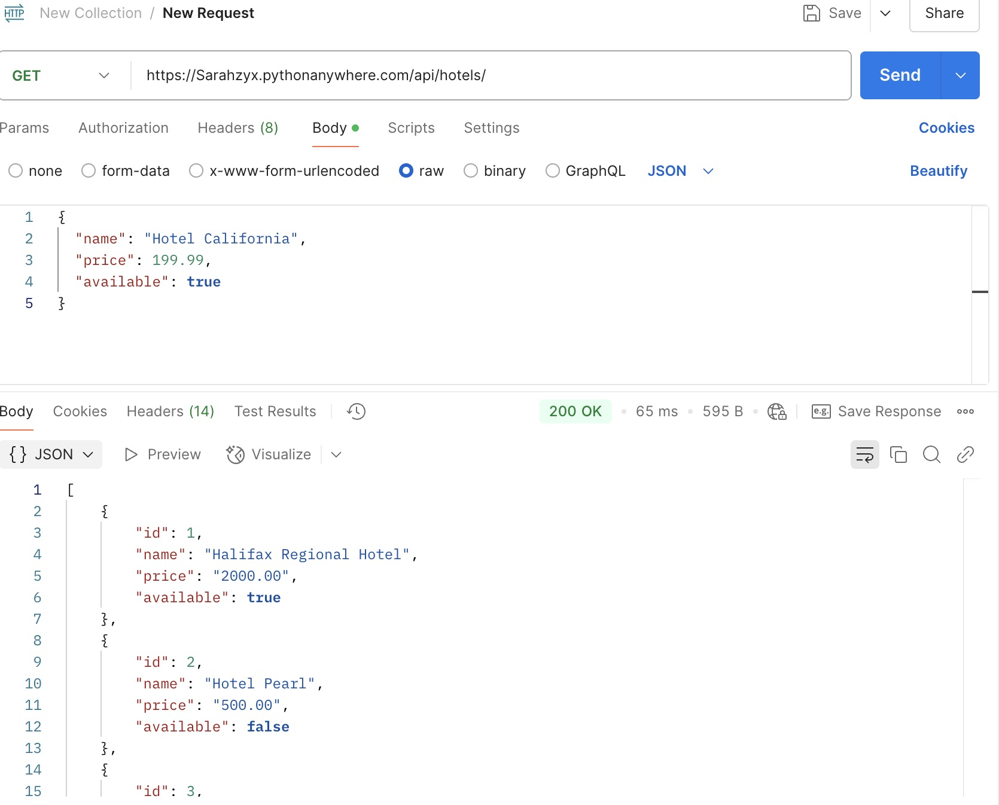
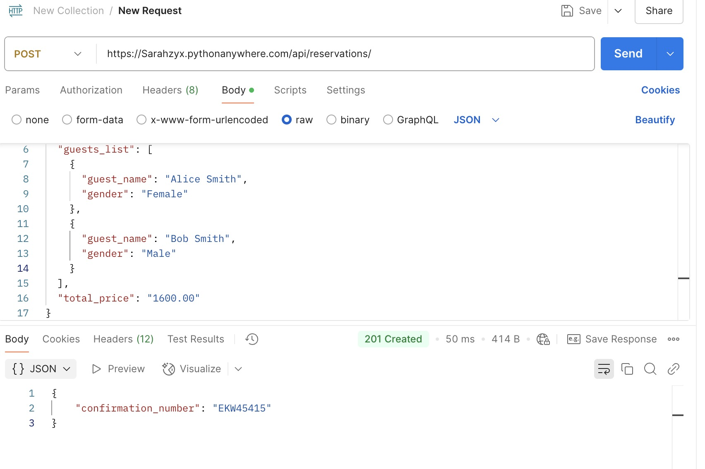
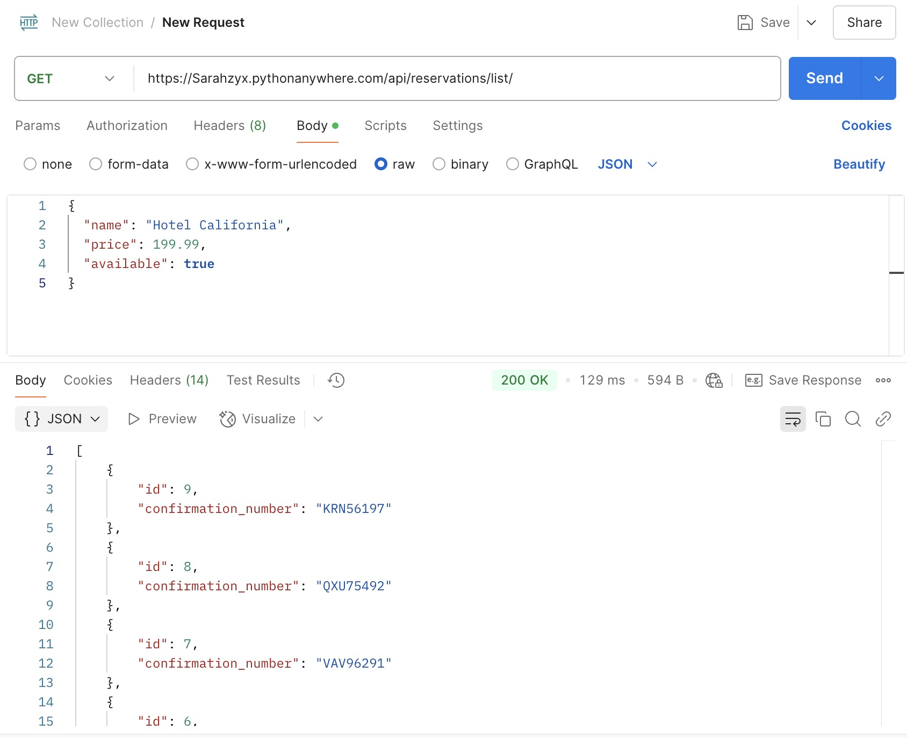
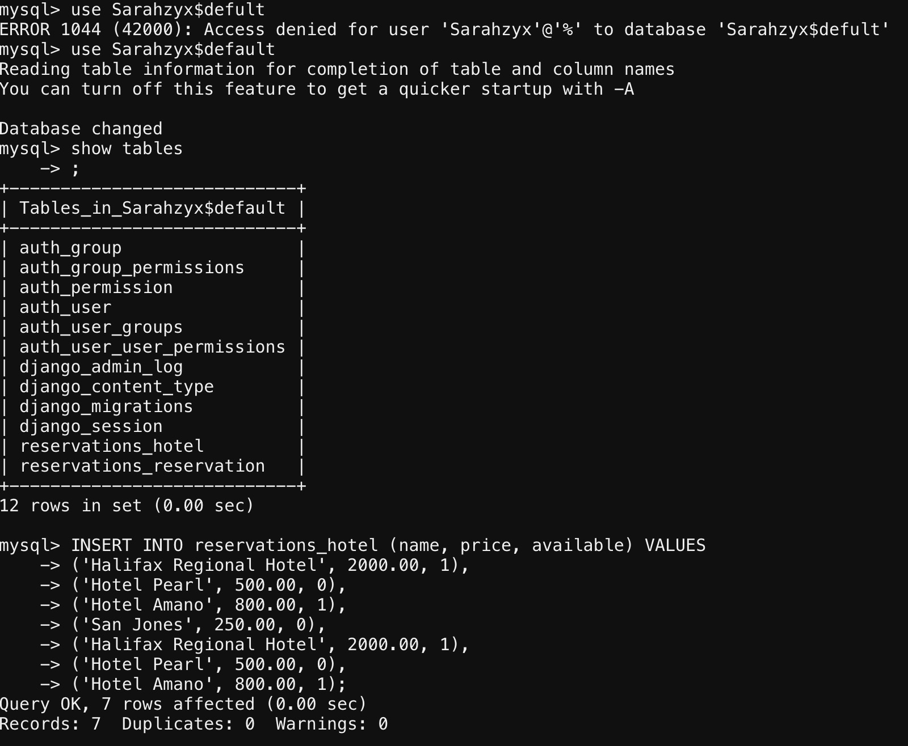

# HotelReservationApi (Django Backend)

**HotelReservationApi** is the backend API for the Android-based **HotelReservationApp** project, developed as part of the MCDA 5550 course REST API assignment (Due: April 16, 2025). This Django REST Framework-based application manages hotel listings and reservation functionalities, fully integrated with a MySQL database and deployed on [PythonAnywhere](https://Sarahzyx.pythonanywhere.com/).

---

## Requirements Checklist

- ✅ **Language/Framework**: Django REST Framework (Python)
- ✅ **Cloud Deployment**: Hosted on [PythonAnywhere](https://Sarahzyx.pythonanywhere.com/)
- ✅ **Version Control**: Submitted via Git  [RepoLink](https://github.com/A00488698/HotelReservationApi.git)
- ✅ **README**: Includes project overview, feature documentation, API definitions, sample usage instructions, credential setup (via `.env`), and Postman testing screenshots for visual verification.
- ✅ **Functionality**: API functions tested via Postman

Below are screenshots demonstrating the functionality of key API endpoints tested using Postman:

| Test Description                       | Screenshot                                |
|----------------------------------------|-------------------------------------------|
| **GET** all hotels (`/api/hotels/`)    |      |
| **POST** a new reservation             |  |
| **GET** reservation list (for testing) |  |

- ✅ **Integration**: Fully connected and functioning with the Android Native App
- ✅ **Data Persistence**: Connected to a MySQL database

- ✅ **Complexity Added**: Includes validation, error handling, and confirmation number formatting, which composed of three random letters and four digits (e.g., ABC1234)

---

## Project Overview

This Django backend supports key features of the hotel reservation workflow:

- **Hotel Listing API**: Returns a list of hotels with their availability and price.
- **Reservation API**: Accepts reservation submissions from the mobile app and returns a confirmation number.
- **MySQL Integration**: All data is stored and retrieved from a MySQL database.
- **CORS Enabled**: Allows cross-origin requests from Android clients.
- **Deployed to PythonAnywhere**: Accessible online via public API endpoints.

---

## Tech Stack

- **Language:** Python 3
- **Framework:** Django 5.2
- **API Toolkit:** Django REST Framework (DRF)
- **Database:** MySQL
- **Hosting:** PythonAnywhere
- **Version Control:** Git (with A# naming and commit history)
- **Other Dependencies:**
  - `python-decouple`: For secure environment variable management
  - `django-cors-headers`: Enables cross-origin resource sharing for mobile clients

---

## Project Structure

```
HotelReservationApi/
├── reservations/              # Main app for hotels and reservations
│   ├── models.py              # Hotel and Reservation models
│   ├── serializers.py         # DRF serializers
│   ├── views.py               # API views
│   └── urls.py                # Route definitions for REST API
├── HotelReservationApi/       # Project-level settings
│   └── settings.py            # Environment settings (uses decouple for DB credentials)
├── manage.py
```

---

## Local Database Configuration

The project uses a **MySQL** backend with connection settings securely loaded via `.env` using `python-decouple`.

**Sample settings in `settings.py`:**
```python
DATABASES = {
    "default": {
        'ENGINE': 'django.db.backends.mysql',
        'NAME': config('DB_NAME'),
        'USER': config('DB_USER'),
        'PASSWORD': config('DB_PASSWORD'),
        'HOST': config('DB_HOST'),
        'PORT': config('DB_PORT', default='3306'),
    }
}
```

**Sample `.env` File:**
```
DB_NAME=your_db_name
DB_USER=your_user
DB_PASSWORD=your_password
DB_HOST=your_host
```

---

## API Endpoints

| Endpoint                   | Method | Description                                              |
|----------------------------|--------|----------------------------------------------------------|
| `/api/hotels/`             | GET    | Returns a list of all available hotels                  |
| `/api/reservations/`       | POST   | Submits a new reservation and returns confirmation info |
| `/api/reservations/list/`  | GET    | **[For testing only]** Returns all reservations in DB   |

---

## Deployment Details

- The backend API is **deployed to PythonAnywhere**, a free and lightweight cloud hosting platform for Python applications.
- The app communicates with this hosted API via the following base URL:  
  `https://Sarahzyx.pythonanywhere.com/`

- The backend connects to a **MySQL database**, enabling the app to:
  - Fetch hotel data (e.g., name, availability, pricing)
  - Submit and store reservation requests
  - Generate confirmation numbers dynamically

- The Android app uses **Retrofit** to perform HTTP requests to the backend. This allows real-time interaction with the remote database without exposing direct access on the client side.

- This deployment strategy supports:
  - **Separation of concerns** between frontend and backend
  - **Secure handling** of sensitive operations like reservations and data writes
  - **Ease of maintenance** and scalability for future backend upgrades

---

## Features

- RESTful APIs to support hotel data and reservation flows
- Simple and secure MySQL integration
- Confirmation number generation on booking (e.g., ABC1234)
- Designed to integrate seamlessly with the HotelReservationApp Android frontend
- Includes testing endpoints for local or Postman validation

---
## 🗂️ Key File Explanations

This section explains the purpose and functionality of the most important files in the backend project:

### `models.py`
Defines the core data models used in the database.

- `Hotel`: Stores hotel names, prices, and availability.
- `Reservation`: Stores reservation records including hotel name, check-in/out dates, customer name, guest list, total price, and a unique confirmation number.
- Includes logic to generate a random confirmation number in the format ABC12345, ensuring uniqueness using a raw SQL check.

### `views.py`
Contains the API logic.

- `HotelListAPI`: Handles GET requests to fetch hotel data.
- `CreateReservationAPI`: Handles POST requests to store a new reservation.
- `ReservationListAPI`: Used for testing – returns a list of all reservations.

### `serializers.py`
Uses Django REST Framework serializers to convert models to/from JSON.

- `HotelSerializer`: Automatically serializes all fields of the `Hotel` model using `model = Hotel` and `fields = '__all__'`.
- `ReservationSerializer`: Automatically serializes all fields of the `Reservation` model using `model = Reservation` and `fields = '__all__'`.

### `urls.py`
Maps endpoint paths to views.

- `/hotels/`: Bound to `HotelListAPI`
- `/reservations/`: Bound to `CreateReservationAPI`
- `/reservations/list/`: Bound to `ReservationListAPI` for testing purposes

### `settings.py`
Project configuration file.

- Connects to the MySQL database using environment variables via `python-decouple`.
- Enables necessary apps like `rest_framework`, `corsheaders`, and custom `reservations` app.
- Configures CORS to allow requests from Android frontend.


### `requirements.txt`
Lists all required packages for the backend project including:

- `Django`
- `djangorestframework`
- `mysqlclient`
- `python-decouple`
- `django-cors-headers`

---

## 🧩 Additional Highlights (Beyond Assignment Requirements)

- **Confirmation Number Uniqueness**: The backend checks whether a generated confirmation number already exists in the database. If it does, it regenerates the confirmation number to ensure uniqueness. This logic is implemented using raw SQL in the `confirmation_exists()` helper function inside `models.py`.


---

## Setup Instructions (Local Development)

1. **Clone the project:**

```bash
git clone https://github.com/A00488698/HotelReservationApi.git
cd HotelReservationApi
```

2. **Create virtual environment & install dependencies:**

```bash
python -m venv venv
source venv/bin/activate  # On Windows use venv\Scripts\activate
pip install -r requirements.txt
```

3. **Create `.env` file for DB credentials (see example above)**

4. **Run migrations:**

```bash
python manage.py migrate
```

5. **Run the server locally:**

```bash
python manage.py runserver
```

---

## Future Improvements

- Add authentication endpoints for secure user login
- Add pagination and filtering to hotel list
- Add reservation history endpoint per customer
- Improve error handling and response structure

---

## Related Frontend

This backend is tightly coupled with the Android frontend project:

🔗 [HotelReservationApp (Android)](https://github.com/A00488698/HotelReservationApp.git)
